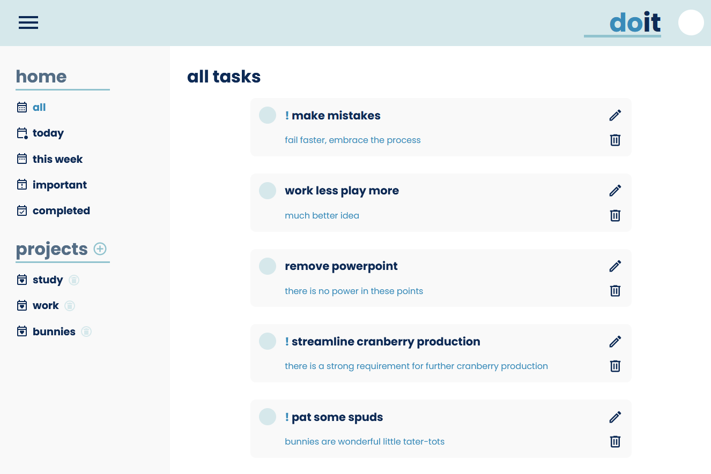

# to-do list

### with some handy-dandy local storage

A neat little to-do project for the [TOP](https://www.theodinproject.com/) curriculum.

My personal objectives for this project were to again further my skills in building larger projects in Vanilla JS and cake it up with a nice design. 🎂

While the scope initially had me a bit out of my depth, I found my comfort in pair-programming with a more senior developer.
My role in this was entirely as the driver, and while I did not require even remotely as much assistance as I had expected, 
I learnt a *lot*.

I was absolutely thrilled to be able to discuss my problem-solving, ideas and receive feedback on my code.

I am hoping to do much, much more collaborative work in the future - it is a blast!

## Learning Outcomes

- Code structuring
- Dynamic DOM manipulation in Vanilla JS
- Using webpack, npm and date-fns
- Stomping lil' bugs

## Things to Continue...

- Create some nice mobile support!
- Use an API for storage
- World domination, I guess, where to go after all that?

### Credit

- Google Fonts for the <a href="https://fonts.google.com/specimen/Poppins">Poppins</a> font.
- Date-fns for the lovely <a href="https://date-fns.org/">date-fns</a> library.
- Pictogrammers for their beautiful <a href="https://pictogrammers.com/">Material Design Icons</a> library.

